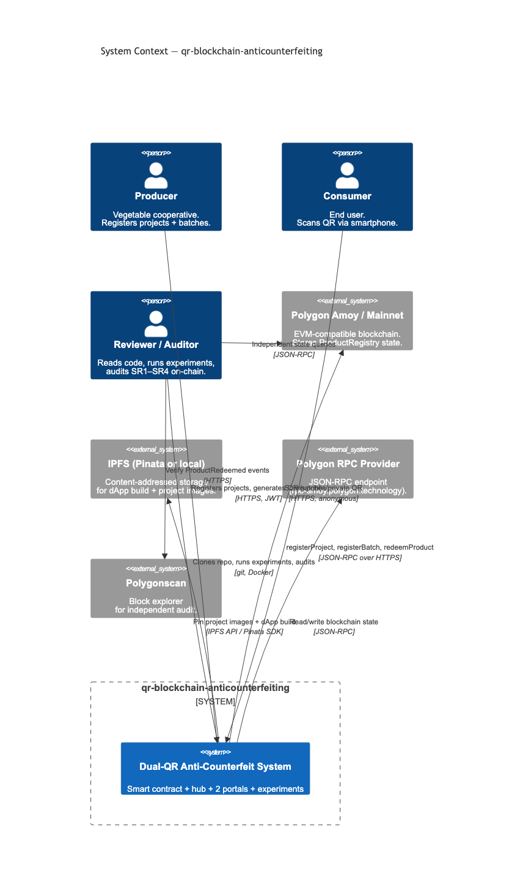
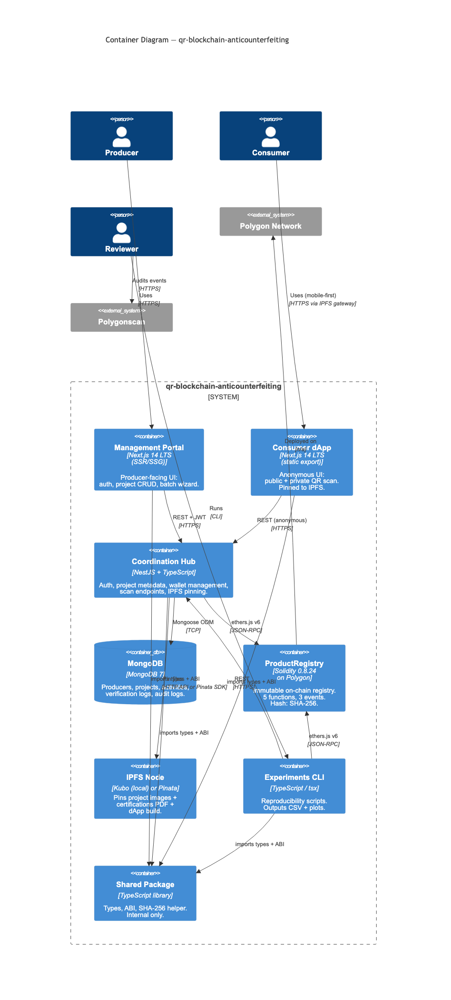
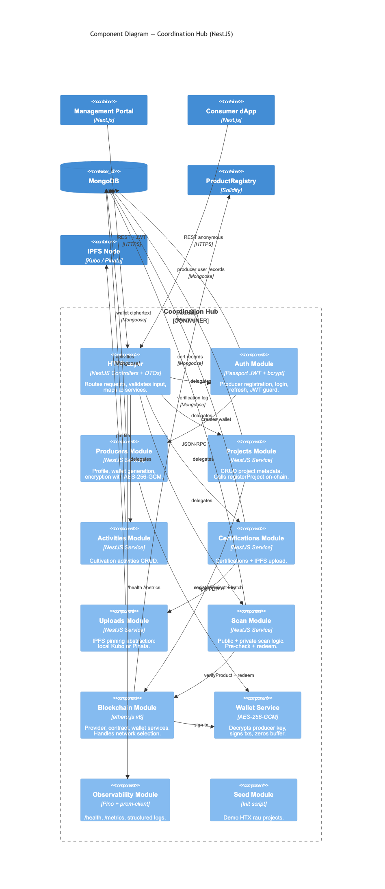

# QR Blockchain Anticounterfeiting

> Reference implementation of the dual-QR blockchain authentication
> scheme described in _"A Dual-QR Blockchain-Based Authentication
> Mechanism for Agricultural Anti-Counterfeiting"_
> (Pham & Trinh, _Frontiers in Blockchain_, 2026).

[](https://github.com/Huy0110/qr-blockchain-anticounterfeiting/actions/workflows/contracts-ci.yml)
[](https://github.com/Huy0110/qr-blockchain-anticounterfeiting/actions/workflows/apps-ci.yml)
[](https://codecov.io/gh/Huy0110/qr-blockchain-anticounterfeiting)
[](https://github.com/Huy0110/qr-blockchain-anticounterfeiting/actions/workflows/contracts-ci.yml)
[](LICENSE)
[](https://doi.org/10.5281/zenodo.20150447)

## Citation

If you use this code or its data in academic work, please cite both
the paper and the software:

```bibtex
@article{Pham2026DualQR,
  title   = {A Dual-QR Blockchain-Based Authentication Mechanism for
             Agricultural Anti-Counterfeiting},
  author  = {Pham, Duc Huy and Trinh, Tuan-Dat},
  journal = {Frontiers in Blockchain},
  year    = {2026},
  note    = {DOI: TBD},
}

@software{Pham2026DualQRSoftware,
  title     = {qr-blockchain-anticounterfeiting: Reference Implementation
               for Dual-QR Blockchain Authentication},
  author    = {Pham, Duc Huy and Trinh, Tuan-Dat},
  year      = {2026},
  version   = {1.0.0},
  url       = {https://github.com/Huy0110/qr-blockchain-anticounterfeiting},
  doi       = {10.5281/zenodo.20150447},
  note      = {Concept DOI; resolves to the latest released version on Zenodo.},
}
```

The article DOI is filled once Frontiers publishes the paper; the
software DOI above is permanent and points to the v1.0.0 Zenodo
deposit at <https://doi.org/10.5281/zenodo.20150447>. See
[`docs/RELEASE.md`](docs/RELEASE.md) for the release pipeline.

## What this is

A complete, reviewer-runnable artifact for the dual-QR
anti-counterfeiting protocol: a Solidity 0.8.24 `ProductRegistry`
contract on Polygon, a NestJS coordination hub, a consumer dApp
(static-exported, IPFS-pinned), a producer-facing management portal,
and a reproducibility suite that regenerates the paper's Tables 3 and 4. The full architecture and the security properties SR1–SR4 are
documented in [`docs/ARCHITECTURE.md`](docs/ARCHITECTURE.md) and
[`docs/THREAT_MODEL.md`](docs/THREAT_MODEL.md).

## Quickstart

Tested on Ubuntu 22.04 LTS and macOS 14. **Target: a clean machine to
a verified private QR scan in under 15 minutes** (AC-DOC-1).

**Prerequisites:** Docker 24+ with Compose v2, `make`, `git`.

```sh
# 1. Clone + bootstrap secrets
git clone https://github.com/Huy0110/qr-blockchain-anticounterfeiting.git
cd qr-blockchain-anticounterfeiting
cp .env.example .env

# .env defaults are fine for the local-only demo profile; if you want
# the testnet profile, set AMOY_RPC_URL, CONTRACT_ADDRESS, and a
# funded SYSTEM_WALLET_PRIVATE_KEY (Amoy faucet:
# https://faucet.polygon.technology/).

# 2. Bring up the full stack (mongo + ipfs + hardhat + contracts
#    deployer + hub + 2 portals) and smoke-test it
make demo
```

After `make demo` reports success:

- Management portal: <http://localhost:3001> — register a producer,
  create a project, run the batch wizard for `N=10`. The wizard
  downloads a ZIP of QR PNGs and the JSON manifest of (publicId,
  secretId) pairs.
- Consumer dApp: <http://localhost:3000> — paste any public-QR URL
  from the manifest to see the project page, or open a private-QR
  URL to verify and redeem the secret.

> The full 15-minute walkthrough — including how to install Docker,
> how to scan a real QR with a phone against the local stack, and the
> expected screen-by-screen states — is in
> [`docs/REPRODUCIBILITY.md`](docs/REPRODUCIBILITY.md).

## Architecture

The system has three deployable units (a NestJS hub, two Next.js
portals), one shared TypeScript package, an immutable Solidity
contract on Polygon, and a reviewer-runnable experiments CLI.





The Coordination Hub is the only non-trivial container; its internal
modules are documented at C4 Level 3:



The full text + tables describing each container, its tech choices,
and the cross-cutting concerns (observability, persistence, secrets)
lives in [`docs/ARCHITECTURE.md`](docs/ARCHITECTURE.md). Architecture
Decision Records are at
[`docs/architecture/decision-log.md`](docs/architecture/decision-log.md).

## Repo structure

```text
.
├── apps/
│   ├── coordination-hub/       NestJS API — auth, projects, scans, IPFS
│   ├── dapp-portal/            Next.js consumer dApp (static export, IPFS-pinned)
│   └── management-portal/      Next.js producer portal (SSR, NextAuth)
├── contracts/                  Foundry + Hardhat workspace — ProductRegistry.sol
├── docs/
│   ├── ARCHITECTURE.md         C4 diagrams + container summary
│   ├── THREAT_MODEL.md         Paper §3.2 verbatim + risk-register mitigations
│   ├── SECURITY_ANALYSIS.md    SR1–SR4 → contract function → test:line → ADR
│   ├── REPRODUCIBILITY.md      Paper Table/Figure → exact command
│   ├── MAINNET_DEPLOY.md       Operator runbook (mainnet not in v1 scope)
│   ├── RELEASE.md              Tag → Pinata → GitHub → Zenodo pipeline
│   ├── CONTRIBUTING.md         Conventional Commits + branch + PR style
│   ├── THIRD_PARTY.md          License inventory (auto-generated)
│   ├── architecture/           decision-log, system-design, tech-stack, …
│   ├── requirements/           gathered requirements, features, glossary
│   ├── tasks/                  per-phase implementation tickets + progress
│   └── images/                 rendered C4 diagrams (PNG + SVG)
├── experiments/                Reviewer CLI — reproduces paper Tables 3 + 4
├── packages/shared/            TypeScript types, ABI, hashing helpers
├── scripts/                    render-mermaid, check-coverage, smoke-test
├── docker-compose.yml          Default profile: mongo+ipfs+hardhat+hub+portals
├── docker-compose.testnet.override.yml    Amoy profile (no local hardhat)
├── docker-compose.prod.override.yml       Hub-only (Atlas + Pinata + mainnet)
└── Makefile                    `make demo`, `make docker-up`, `make test`
```

## Reproducing paper claims

Every measurement in the paper is reproducible from this repo. After
`make demo` is healthy, run from the repo root:

- **Table 3 row 1 (registration latency):** `pnpm exp:perf-registration`
- **Table 3 rows 2–4 (verification latency, public + private valid +
  private invalid + private redeemed):** `pnpm exp:perf-verification`
- **Table 4 (gas + USD cost per operation):** `pnpm exp:cost-analysis`
- **Adversarial resilience (SR1–SR4):** `pnpm exp:adversarial`
- **All of the above + a paper-vs-measured `SUMMARY.md`:** `pnpm exp:all`

Each script prints the paper Table/Figure it reproduces in its first
five stdout lines (AC-EX-12). The full mapping — including which
experiments need an Amoy testnet wallet vs. which run offline against
Hardhat — lives in
[`docs/REPRODUCIBILITY.md`](docs/REPRODUCIBILITY.md).

> **Table 5 (qualitative comparison)** is intentionally not in v1
> scope; the paper's comparison row uses an external dataset that
> isn't part of this artifact. The omission is documented in
> [`docs/REPRODUCIBILITY.md`](docs/REPRODUCIBILITY.md#table-5).

> **Mainnet status:** v1 of this artifact **has not been deployed to
> Polygon mainnet by the authors**. The reviewer-runnable reproducer
> targets Polygon Amoy (testnet); the mainnet promotion runbook in
> [`docs/MAINNET_DEPLOY.md`](docs/MAINNET_DEPLOY.md) documents the
> deploy code path but is intentionally not executed for the v1.0.0
> tag. See also the deploy script
> [`contracts/script/Deploy.s.sol`](contracts/script/Deploy.s.sol),
> which enforces a 5 MATIC minimum balance guard before broadcasting
> to chainid 137.

## Documentation index

| Document                                                                 | For                              |
| ------------------------------------------------------------------------ | -------------------------------- |
| [docs/ARCHITECTURE.md](docs/ARCHITECTURE.md)                             | C4 diagrams + container summary  |
| [docs/THREAT_MODEL.md](docs/THREAT_MODEL.md)                             | Paper §3.2 quotes + mitigations  |
| [docs/SECURITY_ANALYSIS.md](docs/SECURITY_ANALYSIS.md)                   | SR1–SR4 audit trail              |
| [docs/REPRODUCIBILITY.md](docs/REPRODUCIBILITY.md)                       | Reviewer-step-by-step recipes    |
| [docs/MAINNET_DEPLOY.md](docs/MAINNET_DEPLOY.md)                         | Operator runbook (post-v1)       |
| [docs/RELEASE.md](docs/RELEASE.md)                                       | Tag → IPFS → GitHub → Zenodo     |
| [docs/CONTRIBUTING.md](docs/CONTRIBUTING.md)                             | Contributor guide                |
| [docs/THIRD_PARTY.md](docs/THIRD_PARTY.md)                               | Dependency licenses              |
| [docs/architecture/decision-log.md](docs/architecture/decision-log.md)   | ADR-001 … ADR-014                |
| [docs/architecture/system-design.md](docs/architecture/system-design.md) | Observability, persistence, etc. |
| [docs/architecture/tech-stack.md](docs/architecture/tech-stack.md)       | Library versions + rationale     |
| [docs/requirements/](docs/requirements/)                                 | Gathered requirements + glossary |
| [docs/tasks/progress.md](docs/tasks/progress.md)                         | Implementation status            |

## License

Released under the [MIT License](LICENSE) — © 2026 Duc Huy Pham and
Tuan-Dat Trinh.

## Acknowledgements

This artifact accompanies the paper _"A Dual-QR Blockchain-Based
Authentication Mechanism for Agricultural Anti-Counterfeiting"_ to be
submitted to _Frontiers in Blockchain_. We thank the journal's
editors and the anonymous reviewers whose feedback shaped both the
paper and this reproducibility package, the staff at the
**Hanoi University of Science and Technology — School of Information
and Communications Technology** for their guidance, and the open
source maintainers of Foundry, Hardhat, NestJS, Next.js, ethers.js,
mongoose, Pinata, and Polygon, on whose work the implementation rests.
