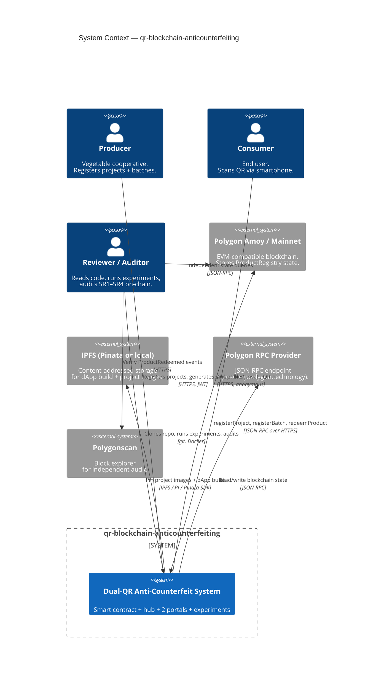
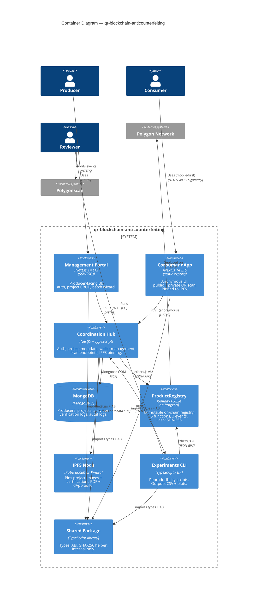
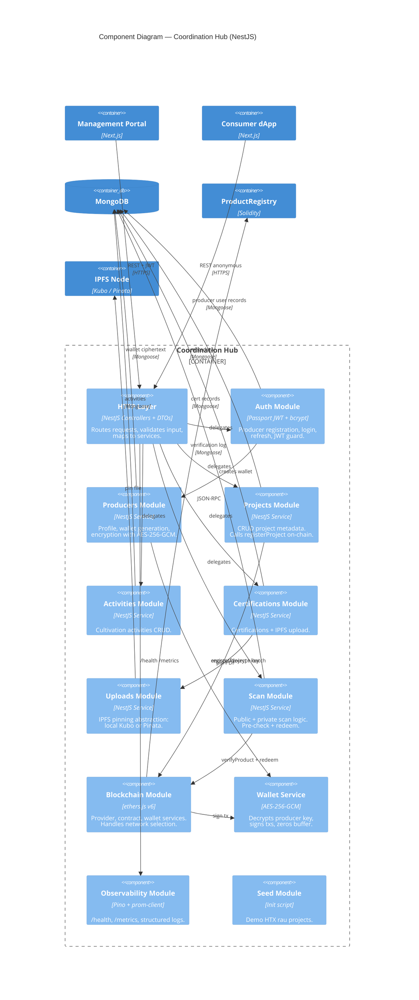

# Architecture

**Project:** `qr-blockchain-anticounterfeiting`
**Skill:** `/03-design-architecture`
**Date:** 2026-05-05
**Master document.** Detailed sub-docs under [`architecture/`](architecture/).

> **English-only architecture docs** — academic audience. Vietnamese is reserved for end-user UI strings (i18n).

---

## Quick map

| What you need                                           | Where                                                                            |
| ------------------------------------------------------- | -------------------------------------------------------------------------------- |
| C4 diagrams (this file)                                 | §1, §2, §3 below                                                                 |
| Sequence diagrams for the 3 paper algorithms            | [architecture/sequence-diagrams.md](architecture/sequence-diagrams.md)           |
| Final folder structure (locked)                         | [architecture/folder-structure.md](architecture/folder-structure.md)             |
| Tech stack rationale                                    | [architecture/tech-stack.md](architecture/tech-stack.md)                         |
| Detailed system design (auth, errors, environments)     | [architecture/system-design.md](architecture/system-design.md)                   |
| Database schema + indexes                               | [architecture/database.md](architecture/database.md)                             |
| Full REST API (OpenAPI 3)                               | [architecture/api-design.md](architecture/api-design.md)                         |
| Inter-service contracts (ABI, env vars, Docker network) | [architecture/inter-service-contract.md](architecture/inter-service-contract.md) |
| Decision log (ADRs)                                     | [architecture/decision-log.md](architecture/decision-log.md)                     |

---

## 1. C4 Level 1 — System Context

The system in its environment, showing actors and external dependencies.

### Actors

| Actor                     | Role in paper             | Code role                                                                             |
| ------------------------- | ------------------------- | ------------------------------------------------------------------------------------- |
| Producer ($\mathcal{P}$)  | Issues product identities | Authenticates to hub; system-managed wallet signs `registerProject` + `registerBatch` |
| Consumer ($\mathcal{C}$)  | Verifies products         | Anonymous; scans QR → dApp → hub → contract                                           |
| Reviewer / Auditor        | Out-of-band trust anchor  | Clones repo, runs `pnpm exp:all`, reads tests, queries Polygonscan                    |
| Adversary ($\mathcal{A}$) | PPT attacker              | Modeled in adversarial tests (F6); not a runtime role                                 |

### External systems

| System        | Purpose                                 | Why we depend on it                                                     |
| ------------- | --------------------------------------- | ----------------------------------------------------------------------- |
| Polygon       | Immutable registry layer                | Paper §8 — selected for low fees + EVM compatibility                    |
| Polygon RPC   | Blockchain access                       | Required to read/write contract state                                   |
| IPFS / Pinata | Decentralized hosting for dApp + images | Paper §5.1 — content-addressed integrity for the verification UI        |
| Polygonscan   | Independent audit interface             | Reviewer can verify `ProductRedeemed` events without our infrastructure |

---

## 2. C4 Level 2 — Container Diagram

Containers (deployable units) inside the system boundary.

### Container summary

| Container         | Tech                                | Deployable                    | Stateful               | Auth                           |
| ----------------- | ----------------------------------- | ----------------------------- | ---------------------- | ------------------------------ |
| Management Portal | Next.js 14 LTS (regular build)      | Vercel / self-hosted          | No (talks to hub)      | NextAuth credentials → hub JWT |
| Consumer dApp     | Next.js 14 LTS (`output: 'export'`) | IPFS (Pinata or local)        | No                     | None (anonymous)               |
| Coordination Hub  | NestJS                              | AWS EC2 / Docker              | No (Mongo holds state) | Issues JWT                     |
| MongoDB           | Mongo 7                             | Docker (local) / Atlas (prod) | Yes                    | DB user/pass                   |
| ProductRegistry   | Solidity 0.8.24                     | Polygon Amoy / mainnet        | Yes (on-chain)         | `msg.sender` modifiers         |
| IPFS Node         | Kubo or Pinata                      | Docker (local) / Pinata SaaS  | Yes (pinned content)   | API key (Pinata)               |
| Experiments CLI   | tsx scripts                         | Run anywhere                  | No                     | None                           |
| Shared Package    | TypeScript library                  | Internal pnpm workspace       | No                     | n/a                            |

---

## 3. C4 Level 3 — Component Diagram (Coordination Hub)

Internal modules of the hub — the only container with non-trivial internal structure.

### Module summary

| Module           | Path                  | Responsibility                                       | Key files                                                                                 |
| ---------------- | --------------------- | ---------------------------------------------------- | ----------------------------------------------------------------------------------------- |
| `auth`           | `src/auth/`           | Register/login/refresh; JWT strategy; guards         | `auth.module.ts`, `auth.service.ts`, `jwt.strategy.ts`, `jwt.guard.ts`                    |
| `producers`      | `src/producers/`      | Profile, system-generated Polygon wallet, encryption | `producers.service.ts`, `producer.schema.ts`                                              |
| `projects`       | `src/projects/`       | Project CRUD + on-chain `registerProject`            | `projects.controller.ts`, `projects.service.ts`                                           |
| `activities`     | `src/activities/`     | Nested cultivation activities                        | `activities.controller.ts`                                                                |
| `certifications` | `src/certifications/` | Cert CRUD + PDF pinning                              | `certifications.controller.ts`                                                            |
| `uploads`        | `src/uploads/`        | IPFS pinning abstraction (local vs Pinata)           | `uploads.service.ts`, `pinata.adapter.ts`, `kubo.adapter.ts`                              |
| `scan`           | `src/scan/`           | Public + private scan endpoints                      | `scan.controller.ts`, `scan.service.ts`                                                   |
| `blockchain`     | `src/blockchain/`     | Provider + contract + wallet services                | `blockchain.module.ts`, `provider.service.ts`, `contract.service.ts`, `wallet.service.ts` |
| `observability`  | `src/observability/`  | Health, metrics, Pino setup                          | `health.controller.ts`, `metrics.controller.ts`, `logger.module.ts`                       |
| `config`         | `src/config/`         | Env validation (Joi or Zod)                          | `config.module.ts`, `env.schema.ts`                                                       |
| `seed`           | `src/seed/`           | Demo HTX rau seeding                                 | `seed.script.ts`, `fixtures/*.json`                                                       |
| `common`         | `src/common/`         | Shared filters, interceptors, pipes                  | `http-exception.filter.ts`, `transform.interceptor.ts`                                    |

---

## 4. Cross-cutting concerns (overview — see `architecture/system-design.md` for detail)

- **Authentication.** Producers: NextAuth credentials provider in management portal → hub JWT. Consumers: anonymous. Hub `I`: holds a system hot wallet (testnet) for `redeemProduct`. Producer wallets generated server-side, encrypted with AES-256-GCM keyed by `WALLET_ENCRYPTION_KEK` env var.
- **Authorization.** Off-chain in hub: ownership check `project.ownerProducerId === req.user.id`. On-chain in contract: `msg.sender == projects[phi].producerAddress` enforced by `registerBatch`.
- **Error handling.** Standardized envelope `{ error: { code, message, details? } }`. NestJS `HttpExceptionFilter` maps domain errors to HTTP status codes (see `system-design.md` §3.4).
- **Logging & metrics.** Pino structured JSON; Prometheus exposition at `/metrics`.
- **Secrets.** `.env.example` only in repo. `gitleaks` in CI + pre-commit. Producer wallet keys never logged (CI grep test).

---

## 5. Decision log (summary — full at [architecture/decision-log.md](architecture/decision-log.md))

| ADR #   | Decision                                                 | Rationale                                                                |
| ------- | -------------------------------------------------------- | ------------------------------------------------------------------------ |
| ADR-001 | Hardhat + Foundry side-by-side                           | Hardhat for deploy/integration JS; Foundry for fast fuzz/property tests. |
| ADR-002 | NestJS over Express                                      | Module DI, decorators, OpenAPI auto-gen, easier test boundaries.         |
| ADR-003 | Next.js App Router with `output: 'export'` for dApp only | Mgmt portal needs runtime auth → SSR. dApp on IPFS → static export.      |
| ADR-004 | Producer wallets server-managed (encrypted at rest)      | Consumer-grade UX; producers don't manage seed phrases.                  |
| ADR-005 | IPFS dual-provider (local Kubo + Pinata)                 | Reproducer chooses; switch via env.                                      |
| ADR-006 | RPC direct (no The Graph)                                | Paper-scale data; The Graph is overkill until > 100k events.             |
| ADR-007 | SHA-256 (`sha256()` precompile) over `keccak256`         | Match paper §7.1 exactly; gas overhead ~60 is acceptable.                |
| ADR-008 | Immutable contract (no proxy)                            | V1 simplicity; reduce attack surface; redeploy if needed.                |

---

## 6. Hand-off to `/04-create-tasks`

Architecture phase produces these artifacts; next skill atomizes [requirements/sequencing.md](requirements/sequencing.md) phases into individual tickets, citing the structural decisions made here.
