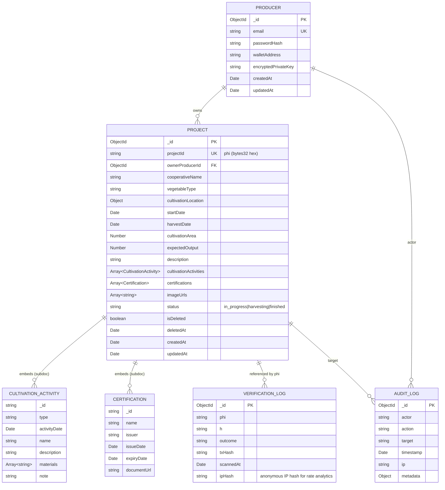

# Database Design

MongoDB schemas, indexes, and ER notes for the Coordination Hub.

---

## 1. Database overview

| Aspect       | Choice                                                        |
| ------------ | ------------------------------------------------------------- |
| Engine       | MongoDB 7                                                     |
| ODM          | Mongoose 8                                                    |
| Local mode   | Docker container (`mongo:7`) at `mongodb://mongo:27017/qr_bc` |
| Production   | MongoDB Atlas (free tier or Flex plan, paper §8.3)            |
| Switch       | `MONGO_URI` env var                                           |
| Transactions | NOT used in v1 (single-document writes only)                  |

Collections:

1. `producers`
2. `projects` (embeds `cultivationActivities`, `certifications` — common Mongoose pattern for parent-owned collections under bounded cardinality)
3. `verificationLogs`
4. `auditLogs`
5. `outboxJobs` (optional, deferred to v2 for retryable wallet operations)

---

## 2. Entity-Relationship overview



---

## 3. Mongoose schemas

### 3.1 `producer.schema.ts`

```typescript
import { Schema, model, Document, Types } from 'mongoose';

export interface ProducerDocument extends Document<Types.ObjectId> {
  email: string;
  passwordHash: string;
  walletAddress: string; // 0x... checksummed
  encryptedPrivateKey: string; // base64 ciphertext (AES-256-GCM)
  encryptionIV: string; // base64 12-byte IV
  encryptionAuthTag: string; // base64 16-byte auth tag
  failedLoginAttempts: number;
  lastFailedLoginAt?: Date;
  lockedUntil?: Date;
  createdAt: Date;
  updatedAt: Date;
}

const producerSchema = new Schema<ProducerDocument>(
  {
    email: {
      type: String,
      required: true,
      unique: true,
      lowercase: true,
      trim: true,
      index: true,
    },
    passwordHash: { type: String, required: true },
    walletAddress: {
      type: String,
      required: true,
      match: /^0x[a-fA-F0-9]{40}$/,
      index: true,
    },
    encryptedPrivateKey: { type: String, required: true },
    encryptionIV: { type: String, required: true },
    encryptionAuthTag: { type: String, required: true },
    failedLoginAttempts: { type: Number, default: 0 },
    lastFailedLoginAt: Date,
    lockedUntil: Date,
  },
  { timestamps: true, collection: 'producers' },
);

producerSchema.index({ email: 1 }, { unique: true });
producerSchema.index({ walletAddress: 1 }, { unique: true });

export const Producer = model<ProducerDocument>('Producer', producerSchema);
```

### 3.2 `project.schema.ts`

```typescript
import { Schema, model, Document, Types } from 'mongoose';

const cultivationActivitySchema = new Schema(
  {
    type: {
      type: String,
      enum: ['land_preparation', 'planting', 'fertilizing', 'pest_control', 'harvesting', 'other'],
      required: true,
    },
    activityDate: { type: Date, required: true },
    name: { type: String, required: true, maxlength: 100 },
    description: { type: String, maxlength: 2000 },
    materials: [{ type: String, maxlength: 100 }],
    note: { type: String, maxlength: 500 },
  },
  { _id: true, timestamps: true },
);

const certificationSchema = new Schema(
  {
    name: { type: String, required: true, maxlength: 100 },
    issuer: { type: String, required: true, maxlength: 200 },
    issueDate: { type: Date, required: true },
    expiryDate: { type: Date },
    documentUrl: { type: String, maxlength: 500 }, // ipfs://CID/...
  },
  { _id: true, timestamps: true },
);

const cultivationLocationSchema = new Schema(
  {
    address: { type: String, required: true, maxlength: 200 },
    province: { type: String, required: true, maxlength: 100 },
    coordinates: {
      lat: { type: Number, min: -90, max: 90 },
      lng: { type: Number, min: -180, max: 180 },
    },
  },
  { _id: false },
);

export interface ProjectDocument extends Document<Types.ObjectId> {
  projectId: string; // phi (bytes32 hex 0x-prefixed, 66 chars)
  ownerProducerId: Types.ObjectId;
  cooperativeName: string;
  vegetableType: string;
  cultivationLocation: {
    address: string;
    province: string;
    coordinates?: { lat: number; lng: number };
  };
  startDate: Date;
  harvestDate: Date;
  cultivationArea: number; // m²
  expectedOutput: number; // kg
  description: string;
  cultivationActivities: any[]; // typed via subdocument
  certifications: any[];
  imageUrls: string[];
  status: 'in_progress' | 'harvesting' | 'finished';
  isDeleted: boolean;
  deletedAt?: Date;
  txHashRegisterProject?: string;
  createdAt: Date;
  updatedAt: Date;
}

const projectSchema = new Schema<ProjectDocument>(
  {
    projectId: {
      type: String,
      required: true,
      unique: true,
      match: /^0x[a-fA-F0-9]{64}$/,
      index: true,
    },
    ownerProducerId: { type: Schema.Types.ObjectId, ref: 'Producer', required: true, index: true },
    cooperativeName: { type: String, required: true, maxlength: 200 },
    vegetableType: { type: String, required: true, maxlength: 100 },
    cultivationLocation: { type: cultivationLocationSchema, required: true },
    startDate: { type: Date, required: true },
    harvestDate: { type: Date, required: true },
    cultivationArea: { type: Number, required: true, min: 0 },
    expectedOutput: { type: Number, required: true, min: 0 },
    description: { type: String, default: '', maxlength: 5000 },
    cultivationActivities: [cultivationActivitySchema],
    certifications: [certificationSchema],
    imageUrls: [{ type: String, maxlength: 500 }],
    status: {
      type: String,
      enum: ['in_progress', 'harvesting', 'finished'],
      default: 'in_progress',
      index: true,
    },
    isDeleted: { type: Boolean, default: false, index: true },
    deletedAt: Date,
    txHashRegisterProject: String,
  },
  { timestamps: true, collection: 'projects' },
);

projectSchema.index({ projectId: 1 }, { unique: true });
projectSchema.index({ ownerProducerId: 1, isDeleted: 1, createdAt: -1 });
projectSchema.index({ status: 1, isDeleted: 1 });
projectSchema.index({ cooperativeName: 'text', vegetableType: 'text', description: 'text' });

export const Project = model<ProjectDocument>('Project', projectSchema);
```

### 3.3 `verification-log.schema.ts`

```typescript
import { Schema, model, Document, Types } from 'mongoose';

export interface VerificationLogDocument extends Document<Types.ObjectId> {
  phi: string;
  h: string; // sha256(sid)
  outcome: 'AUTHENTIC' | 'ALREADY_VERIFIED' | 'COUNTERFEIT';
  txHash?: string;
  scannedAt: Date;
  ipHash: string; // sha256(IP + DAILY_SALT) — anonymous, not reversible
  userAgentSummary?: string; // short tag like 'iOS/Safari'
}

const verificationLogSchema = new Schema<VerificationLogDocument>(
  {
    phi: { type: String, required: true, match: /^0x[a-fA-F0-9]{64}$/, index: true },
    h: { type: String, required: true, match: /^0x[a-fA-F0-9]{64}$/ },
    outcome: {
      type: String,
      enum: ['AUTHENTIC', 'ALREADY_VERIFIED', 'COUNTERFEIT'],
      required: true,
      index: true,
    },
    txHash: { type: String, match: /^0x[a-fA-F0-9]{64}$/ },
    scannedAt: { type: Date, required: true, default: Date.now, index: true },
    ipHash: { type: String, required: true },
    userAgentSummary: { type: String, maxlength: 100 },
  },
  { timestamps: false, collection: 'verificationLogs' },
);

verificationLogSchema.index({ phi: 1, scannedAt: -1 });
verificationLogSchema.index({ phi: 1, outcome: 1 });

// TTL: optionally drop logs after 2 years for storage hygiene (configurable)
// verificationLogSchema.index({ scannedAt: 1 }, { expireAfterSeconds: 60 * 60 * 24 * 365 * 2 });

export const VerificationLog = model<VerificationLogDocument>(
  'VerificationLog',
  verificationLogSchema,
);
```

### 3.4 `audit-log.schema.ts`

```typescript
import { Schema, model, Document, Types } from 'mongoose';

export interface AuditLogDocument extends Document<Types.ObjectId> {
  actor: string; // producerId or 'system' or 'anon'
  action: string; // 'PROJECT_CREATE', 'BATCH_REGISTER', etc.
  target?: string; // resource id (phi, producerId, etc.)
  timestamp: Date;
  ipHash?: string;
  metadata?: Record<string, unknown>;
}

const auditLogSchema = new Schema<AuditLogDocument>(
  {
    actor: { type: String, required: true, index: true },
    action: { type: String, required: true, index: true },
    target: { type: String, index: true },
    timestamp: { type: Date, required: true, default: Date.now, index: true },
    ipHash: String,
    metadata: { type: Schema.Types.Mixed },
  },
  { timestamps: false, collection: 'auditLogs' },
);

auditLogSchema.index({ actor: 1, timestamp: -1 });
auditLogSchema.index({ action: 1, timestamp: -1 });

export const AuditLog = model<AuditLogDocument>('AuditLog', auditLogSchema);
```

---

## 4. Index summary

| Collection         | Index                                                                   | Purpose                                                        |
| ------------------ | ----------------------------------------------------------------------- | -------------------------------------------------------------- |
| `producers`        | `{email: 1}` unique                                                     | login lookup                                                   |
| `producers`        | `{walletAddress: 1}` unique                                             | guard against duplicate wallet generation collision            |
| `projects`         | `{projectId: 1}` unique                                                 | primary phi lookup                                             |
| `projects`         | `{ownerProducerId: 1, isDeleted: 1, createdAt: -1}`                     | producer dashboard listing (newest first, filter soft-deleted) |
| `projects`         | `{status: 1, isDeleted: 1}`                                             | analytics queries                                              |
| `projects`         | `{cooperativeName: 'text', vegetableType: 'text', description: 'text'}` | text search (deferred to v2)                                   |
| `verificationLogs` | `{phi: 1, scannedAt: -1}`                                               | per-project verification timeline                              |
| `verificationLogs` | `{phi: 1, outcome: 1}`                                                  | outcome counts per project                                     |
| `verificationLogs` | `{outcome: 1}`                                                          | global outcome distribution (admin/analytics)                  |
| `auditLogs`        | `{actor: 1, timestamp: -1}`                                             | per-actor audit trail                                          |
| `auditLogs`        | `{action: 1, timestamp: -1}`                                            | action analytics                                               |
| `auditLogs`        | `{target: 1}`                                                           | per-resource audit trail                                       |

---

## 5. Migration strategy

- v1 has no migrations (fresh schema). Migration tooling deferred until v2.
- For destructive schema changes in v2+: use `migrate-mongo` package; migration scripts in `apps/coordination-hub/migrations/` (folder TBD).
- For seed data: idempotent `pnpm seed` script (see [features/docs-and-branding.md](../requirements/features/docs-and-branding.md) F12).

---

## 6. Backup / disaster recovery (operator notes)

In v1 the author runs only locally + testnet, so DR is out of scope. Documented for future operator:

- MongoDB Atlas: enable continuous backup (free tier allows daily snapshots).
- Producer wallet keys: encrypted server-side; document recovery procedure (`KEK` rotation requires re-encrypting all `encryptedPrivateKey` documents — script lives in `apps/coordination-hub/scripts/rotate-kek.ts`, deferred to v2).
- On-chain state is its own DR: re-deploy hub against existing contract address; producer projects + redemption history are recoverable from on-chain events.

---

## 7. Data retention

| Collection         | Retention                                                      | Reason                                                       |
| ------------------ | -------------------------------------------------------------- | ------------------------------------------------------------ |
| `producers`        | Indefinite (until self-delete)                                 | account                                                      |
| `projects`         | Indefinite, with soft-delete (`isDeleted=true`)                | audit trail; can be hard-deleted by GDPR-style request later |
| `verificationLogs` | Default indefinite; optional TTL 2 years (commented in schema) | analytics + compliance                                       |
| `auditLogs`        | Indefinite                                                     | compliance / forensic                                        |

---

## 8. Why MongoDB (vs PostgreSQL)?

| Factor                                                                         | MongoDB                         | PostgreSQL                    |
| ------------------------------------------------------------------------------ | ------------------------------- | ----------------------------- | ----------- |
| Paper §8                                                                       | ✅ explicitly used              | ❌                            |
| Schema flexibility (cultivation activities are nested arrays of varying shape) | ✅ ideal                        | requires JSONB or join tables |
| Multi-document transactions                                                    | weaker (replica set req'd)      | strong                        | (n/a in v1) |
| Free tier (Atlas)                                                              | ✅ 512 MB                       | ✅ Supabase / Neon / etc.     |
| Mongoose DX                                                                    | ✅ matches paper reference repo | n/a                           |

Verdict: MongoDB matches paper, fits the data shape, and minimizes deviation from §8. PostgreSQL would be a more conservative choice but unnecessary; if v2 needs strict transactions we'll revisit.

---

## 9. Schema validation at runtime

In addition to Mongoose schema constraints, every API request validates DTOs via Zod schemas in `@qr-bc/shared`. Validation tier:

1. HTTP layer: Zod via `ZodValidationPipe` (NestJS pipe).
2. Service layer: TypeScript types (compile-time only).
3. Persistence layer: Mongoose schema validators (runtime; final defense).

Defense-in-depth: a malformed payload bypassing the pipe still hits Mongoose validation.
