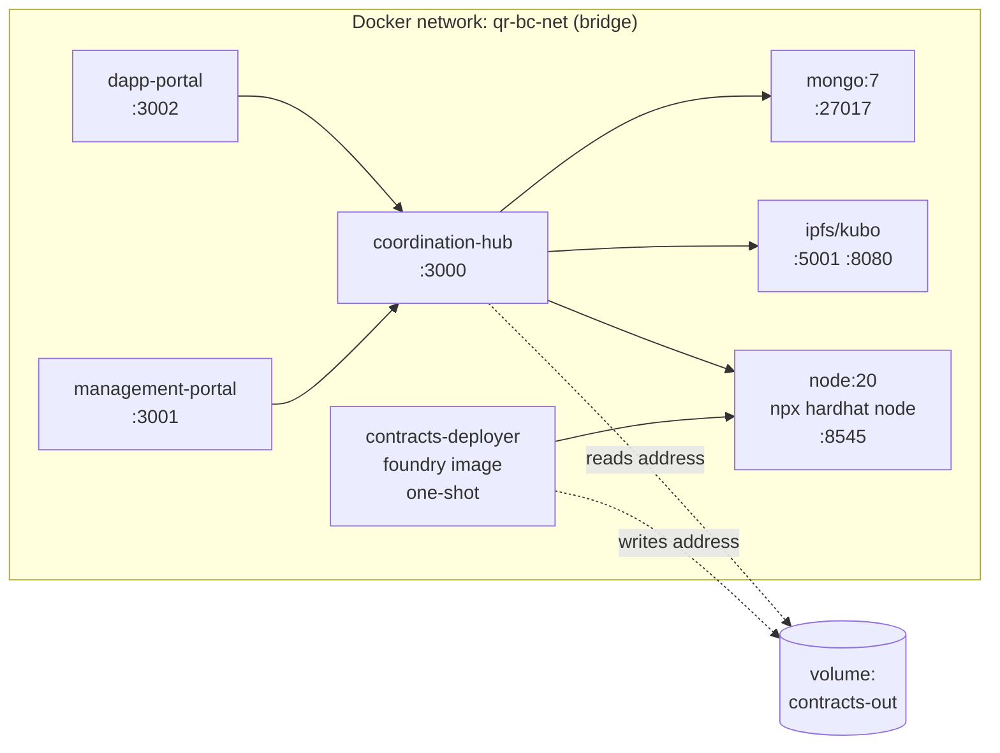

# Inter-Service Contracts

How services see each other: ABI shape, env vars, Docker network, and shared package surface.

---

## 1. Smart contract ABI consumed by `@qr-bc/shared`

The shared package re-exports a minimal, frozen subset of the Foundry build artifact.

### Build pipeline

```
contracts/src/ProductRegistry.sol
        │
        │  forge build (or hardhat compile)
        ▼
contracts/out/ProductRegistry.sol/ProductRegistry.json
        │
        │  packages/shared/scripts/build-abi.ts
        │  (filters fields, copies into shared)
        ▼
packages/shared/src/abi/ProductRegistry.json    ← committed
        │
        │  re-exported from src/index.ts
        ▼
import { ProductRegistryABI, ProductRegistryAddress } from '@qr-bc/shared';
```

### `build-abi.ts` script behavior

```typescript
// Reads contracts/out/ProductRegistry.sol/ProductRegistry.json
// Extracts: { abi, contractName, sourceName, deployedBytecode }
// Strips: bytecode, deployedBytecode, methodIdentifiers, devdoc, userdoc, ast, gasEstimates
// (Bytecode/devdoc are large; consumers don't need them at runtime.)
// Writes: packages/shared/src/abi/ProductRegistry.json (formatted JSON, deterministic key order)

// Also writes packages/shared/src/abi/types.ts with TypeChain-style typed contract:
//   import { Contract } from 'ethers';
//   export type ProductRegistryContract = Contract & {
//     registerProject(phi: BytesLike, ...): Promise<TransactionResponse>;
//     ...
//   };
```

CI gate: `pnpm --filter @qr-bc/shared build:abi` must produce identical output to what's committed; mismatch fails CI (catches stale ABIs).

### Public ABI surface

```typescript
// packages/shared/src/index.ts
export { default as ProductRegistryABI } from './abi/ProductRegistry.json';
export * from './abi/types'; // typed contract interface
export type {
  Phi,
  Sid,
  Hash,
  Address,
  VerificationOutcome,
  ProjectMetadata,
  CultivationActivity,
  Certification,
  ProductRedeemedEvent,
} from './types';
export { hashSid, generateSid } from './hashing';
export { ProjectMetadataSchema, CultivationActivitySchema, CertificationSchema } from './schemas';
```

### Address resolution

The contract address is environment-specific. NOT shipped via `@qr-bc/shared`; loaded from env at runtime.

| Network           | Source                                                                        |
| ----------------- | ----------------------------------------------------------------------------- |
| `hardhat` (local) | `contracts/out/address.local.json` (written by deployer container at startup) |
| `amoy`            | `CONTRACT_ADDRESS_AMOY` env var                                               |
| `mainnet`         | `CONTRACT_ADDRESS_MAINNET` env var                                            |

Hub `BlockchainModule` exposes a `ContractService` that constructs the typed contract once at startup using the correct address + ABI from `@qr-bc/shared`.

---

## 2. Hub REST contract consumed by frontends + experiments

- Source of truth: NestJS controllers + Swagger decorators.
- Spec at runtime: `GET /api/docs-json`.
- For frontend type generation: `apps/coordination-hub/scripts/export-openapi.ts` runs at hub start (or in CI) and writes `openapi.json` into `packages/shared/src/openapi.json`.
- Frontends use a typed fetch client. Choice (decided in implementation phase): `openapi-fetch` (lightweight) or hand-rolled with shared TS types from `@qr-bc/shared` (simpler, no codegen step).

---

## 3. Environment variables — per service

### Root (`.env.example` for docker-compose)

```
# Profile selector
COMPOSE_PROFILES=default          # default | testnet | prod

# Shared by hub + experiments
NETWORK=hardhat                    # hardhat | amoy | mainnet
RPC_URL_HARDHAT=http://hardhat:8545
RPC_URL_AMOY=https://rpc-amoy.polygon.technology
RPC_URL_MAINNET=https://polygon-rpc.com
CONTRACT_ADDRESS_AMOY=
CONTRACT_ADDRESS_MAINNET=
# CONTRACT_ADDRESS_HARDHAT auto-loaded from contracts/out/address.local.json
```

### `apps/coordination-hub/.env.example`

```
# App
NODE_ENV=development
PORT=3000
LOG_LEVEL=info
EXPOSE_SWAGGER=true
CORS_ORIGINS=http://localhost:3001,http://localhost:3002

# Auth
JWT_SECRET=                        # 32 random bytes (base64)
JWT_EXPIRES_IN=24h
REFRESH_SECRET=
REFRESH_EXPIRES_IN=30d

# Wallet encryption
WALLET_ENCRYPTION_KEK=             # 32 random bytes (base64)

# Database
MONGO_URI=mongodb://mongo:27017/qr_bc

# Blockchain
NETWORK=hardhat
RPC_URL=http://hardhat:8545        # resolved by NETWORK
CONTRACT_ADDRESS=
SYSTEM_WALLET_PRIVATE_KEY=         # hub's hot wallet (testnet only!)
TX_CONFIRMATIONS=1
TX_TIMEOUT_SECONDS=60

# IPFS
IPFS_PROVIDER=local                # local | pinata
IPFS_API_URL=http://ipfs:5001
IPFS_GATEWAY_URL=http://ipfs:8080
PINATA_JWT=

# Rate limit / observability
RATE_LIMIT_LOGIN_PER_15M=5
RATE_LIMIT_REGISTER_PER_HOUR=3
RATE_LIMIT_SCAN_PRIVATE_PER_MIN=60
RATE_LIMIT_AUTH_GENERIC_PER_MIN=600

# Misc
DAILY_SALT_ROTATE_HOUR_UTC=0       # rotates the IP-hashing salt daily
LOG_PUBLIC_SCANS=true
```

### `apps/management-portal/.env.example`

```
# Public (exposed to client bundle)
NEXT_PUBLIC_HUB_BASE_URL=http://localhost:3000/api/v1
NEXT_PUBLIC_DEFAULT_LOCALE=vi
NEXT_PUBLIC_SUPPORTED_LOCALES=vi,en
NEXT_PUBLIC_BLOCKCHAIN_EXPLORER=https://amoy.polygonscan.com
NEXT_PUBLIC_NETWORK=amoy

# Server-only (NextAuth)
NEXTAUTH_URL=http://localhost:3001
NEXTAUTH_SECRET=                   # 32 random bytes
```

### `apps/dapp-portal/.env.example`

```
# All NEXT_PUBLIC_ since dApp is fully static (no server)
NEXT_PUBLIC_HUB_BASE_URL=http://localhost:3000/api/v1
NEXT_PUBLIC_DEFAULT_LOCALE=vi
NEXT_PUBLIC_SUPPORTED_LOCALES=vi,en
NEXT_PUBLIC_BLOCKCHAIN_EXPLORER=https://amoy.polygonscan.com
NEXT_PUBLIC_NETWORK=amoy
NEXT_PUBLIC_GITHUB_REPO=https://github.com/Huy0110/qr-blockchain-anticounterfeiting
NEXT_PUBLIC_PAPER_DOI=             # filled post-Zenodo mint
NEXT_PUBLIC_BUILD_CID=             # injected post-pin
NEXT_PUBLIC_IPFS_GATEWAY=https://ipfs.io/ipfs
```

### `experiments/.env.example`

```
NETWORK=amoy                       # use hardhat for offline CI; amoy for human runs
RPC_URL=                           # resolved by NETWORK
CONTRACT_ADDRESS=
HUB_BASE_URL=http://localhost:3000/api/v1
PRODUCER_PRIVATE_KEY=              # for direct on-chain calls in adversarial tests
TRIALS=30                          # default
RUN_ID=                            # ISO timestamp default
RESULTS_DIR=./results
```

### `contracts/.env.example`

```
DEPLOYER_PRIVATE_KEY=              # for forge script Deploy.s.sol
RPC_URL_AMOY=https://rpc-amoy.polygon.technology
RPC_URL_MAINNET=https://polygon-rpc.com
ETHERSCAN_API_KEY=                 # for Polygonscan verification
```

### Validation

Every service has a Zod / Joi env schema at startup. Missing required → process exits 1 with a list of unset vars. CI runs `dotenv-validator` to ensure no env var referenced in code is missing from `.env.example`.

---

## 4. Docker network topology (`docker-compose.yml`)

### Default profile



### Service definitions (key fields)

```yaml
services:
  mongo:
    image: mongo:7
    volumes:
      - mongo-data:/data/db
    healthcheck:
      test: ['CMD', 'mongosh', '--quiet', '--eval', 'db.runCommand({ ping: 1 })']
      interval: 5s
      retries: 12
    networks: [qr-bc-net]

  ipfs:
    image: ipfs/kubo:latest
    ports:
      - '5001:5001'
      - '8080:8080'
    volumes:
      - ipfs-data:/data/ipfs
    healthcheck:
      test: ['CMD-SHELL', 'wget -q -O- http://localhost:5001/api/v0/version || exit 1']
      interval: 5s
      retries: 12
    networks: [qr-bc-net]

  hardhat:
    profiles: [default]
    build: ./contracts
    command: ['npx', 'hardhat', 'node', '--hostname', '0.0.0.0']
    ports:
      - '8545:8545'
    healthcheck:
      test:
        [
          'CMD-SHELL',
          'curl -s -X POST http://localhost:8545 -d ''{"jsonrpc":"2.0","method":"eth_blockNumber","id":1}'' || exit 1',
        ]
      interval: 5s
      retries: 12
    networks: [qr-bc-net]

  contracts-deployer:
    profiles: [default]
    build: ./contracts
    depends_on:
      hardhat: { condition: service_healthy }
    command: ['pnpm', 'deploy:hardhat']
    volumes:
      - contracts-out:/app/out
    networks: [qr-bc-net]

  coordination-hub:
    build: ./apps/coordination-hub
    depends_on:
      mongo: { condition: service_healthy }
      ipfs: { condition: service_healthy }
      hardhat: { condition: service_healthy, required: false } # only in default profile
    environment:
      NETWORK: ${NETWORK:-hardhat}
      MONGO_URI: mongodb://mongo:27017/qr_bc
      IPFS_API_URL: http://ipfs:5001
      RPC_URL_HARDHAT: http://hardhat:8545
    volumes:
      - contracts-out:/contracts-out:ro
      - ./apps/coordination-hub/src:/app/src:ro # hot reload in dev
    ports:
      - '3000:3000'
    healthcheck:
      test: ['CMD-SHELL', 'curl -s http://localhost:3000/api/v1/health || exit 1']
    networks: [qr-bc-net]

  management-portal:
    build: ./apps/management-portal
    depends_on:
      coordination-hub: { condition: service_healthy }
    environment:
      NEXT_PUBLIC_HUB_BASE_URL: http://localhost:3000/api/v1
    ports:
      - '3001:3001'
    networks: [qr-bc-net]

  dapp-portal:
    build: ./apps/dapp-portal
    depends_on:
      coordination-hub: { condition: service_healthy }
    environment:
      NEXT_PUBLIC_HUB_BASE_URL: http://localhost:3000/api/v1
    ports:
      - '3002:3002'
    networks: [qr-bc-net]

volumes:
  mongo-data:
  ipfs-data:
  contracts-out:

networks:
  qr-bc-net:
    driver: bridge
```

### Port allocation summary

| Port  | Service           | Notes                           |
| ----- | ----------------- | ------------------------------- |
| 3000  | Coordination Hub  | API + Swagger                   |
| 3001  | Management Portal | Producer UI                     |
| 3002  | Consumer dApp     | Anonymous UI (mobile)           |
| 5001  | IPFS API          | Kubo HTTP API                   |
| 8080  | IPFS Gateway      | `localhost:8080/ipfs/<CID>/...` |
| 8545  | Hardhat node      | Local EVM RPC                   |
| 27017 | MongoDB           | Local DB                        |

### Profile differences

| Profile   | Services started                                                    | Use case                                              |
| --------- | ------------------------------------------------------------------- | ----------------------------------------------------- |
| `default` | All including hardhat + deployer                                    | Offline dev / CI / reviewer reproduce without testnet |
| `testnet` | mongo + ipfs + hub + portals (NO hardhat / deployer)                | Run against Polygon Amoy                              |
| `prod`    | hub only (mongo + ipfs externalized to Atlas + Pinata; mainnet RPC) | Production deployment                                 |

---

## 5. Internal contract: hub ↔ shared package

The hub uses `@qr-bc/shared` to ensure consistency:

```typescript
// apps/coordination-hub/src/blockchain/contract.service.ts
import { ProductRegistryABI, ProductRegistryContract, hashSid } from '@qr-bc/shared';
import { ethers } from 'ethers';

@Injectable()
export class ContractService {
  private contract: ProductRegistryContract;

  constructor(
    @Inject(PROVIDER_TOKEN) private provider: ethers.Provider,
    config: ConfigService,
  ) {
    const address = config.get('CONTRACT_ADDRESS');
    this.contract = new ethers.Contract(
      address,
      ProductRegistryABI,
      this.provider,
    ) as ProductRegistryContract;
  }

  async verifyProduct(phi: string, h: string) {
    return this.contract.verifyProduct(phi, h);
  }
  // ...
}
```

The hub never imports raw bytecode or compilation artifacts — only ABI + types via `@qr-bc/shared`.

---

## 6. Internal contract: dApp ↔ shared package

dApp imports types only (no ABI needed since it never talks to chain directly):

```typescript
import type { ProjectMetadata, VerificationOutcome } from '@qr-bc/shared';
```

The hub does all chain interaction; dApp displays returned outcomes.

---

## 7. Pinning workflow contract (release.yml ↔ Pinata)

```
GitHub Actions release.yml on tag v*.*.*
       │
       │  pnpm --filter dapp-portal build       (Next.js export)
       │  → out/
       ▼
       │  pnpm dlx @pinata/cli pin out/  --token $PINATA_JWT
       ▼
       Pinata API responds with CID
       │
       │  echo "::set-output name=cid::<CID>"
       ▼
       │  Update apps/dapp-portal/.env.production with NEXT_PUBLIC_BUILD_CID
       │  Rebuild + repin (so the footer-displayed CID matches)
       ▼
       │  GitHub Release notes include CID + ipfs.io URL
       │
       │  Zenodo GitHub integration auto-mints DOI
       ▼
       Done. DOI URL added to README + CITATION.cff in a follow-up commit.
```

Edge case: rebuilding to embed CID changes the build, hence changes CID. Solution: footer reads CID from URL pathname at runtime (since the dApp lives at `ipfs.io/ipfs/<CID>/`) — no build-time injection needed.

---

## 8. Network topology summary

```
                                ┌─────────────┐
                                │  Polygonscan │
                                └──────────────┘
                                       ▲ HTTPS (reviewer)
                                       │
   Producer ──HTTPS──► Mgmt Portal ──HTTPS──► Coordination Hub ──JSON-RPC──► Polygon (Amoy / mainnet)
                                                  │                                ▲
   Consumer ──HTTPS──► dApp on IPFS ──HTTPS──────┤                                │
                            │                     │                                │
                            └── direct or via gateway                              │
                                                  │                                │
                                                  ▼                                │
                                              MongoDB                              │
                                              (state)                              │
                                                  │                                │
                                                  ▼                                │
                                              IPFS (Pinata / local)                │
                                                                                   │
   Reviewer ──CLI──► experiments scripts ─────────────────────────────────────────┘
                                                  │
                                                  └──► Hub (REST)
```
