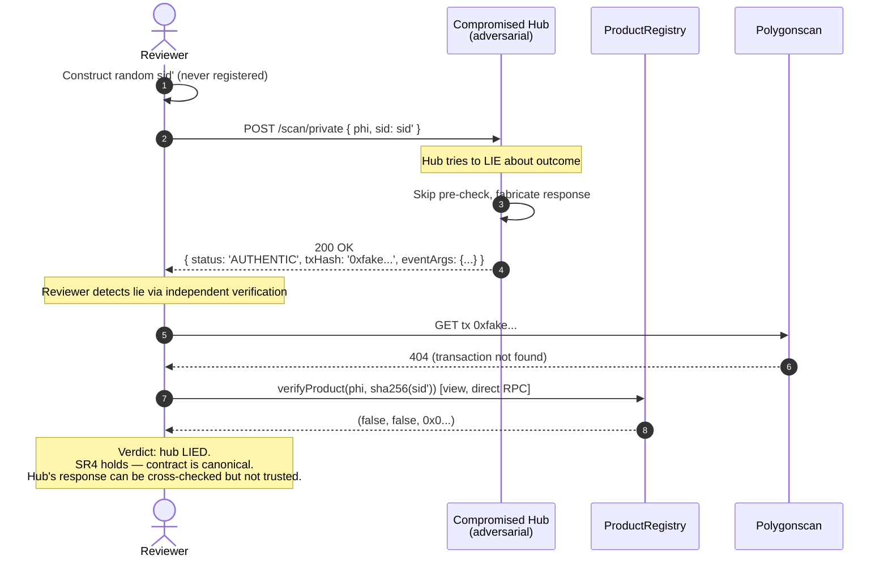

# Sequence Diagrams — Paper Algorithms

Three Mermaid sequence diagrams covering paper Algorithms 1–3 ([frontiers.tex](../../qr_code_new_2026_02/frontiers.tex) lines 509–689) end-to-end, with the actual cross-component calls our implementation will make.

> **Notation note.** Symbols match paper notation table (`frontiers.tex` lines 1346–1409). See [glossary.md](../requirements/glossary.md) for code ↔ paper mapping.

---

## 1. Algorithm 1 — `RegisterProducts(phi, N, addr_P)` (paper lines 509–553)

End-to-end flow when a producer creates a project and generates a batch of QR codes.

```mermaid
sequenceDiagram
    autonumber
    actor P as Producer 𝒫
    participant MP as Management Portal
    participant HUB as Coordination Hub
    participant DB as MongoDB
    participant WS as WalletService
    participant CHAIN as ProductRegistry (on Polygon)
    participant IPFS as IPFS (Pinata/Kubo)

    P->>MP: Open "New Project" form, submit metadata
    MP->>HUB: POST /api/v1/projects (JWT)
    HUB->>HUB: Zod validate CreateProjectRequest
    HUB->>HUB: Generate phi = randomBytes(32)
    HUB->>CHAIN: projectExists(phi) [view, no gas]
    CHAIN-->>HUB: false
    HUB->>DB: insert Project{projectId: phi, ownerProducerId, ...}
    DB-->>HUB: { _id }

    HUB->>WS: decryptKey(producer.encryptedPrivateKey)
    WS-->>HUB: privateKey (in-memory)
    HUB->>CHAIN: registerProject(phi) — signed by producer wallet
    Note over CHAIN: Stores projects[phi] = (msg.sender, true)<br/>Emits ProjectCreated(phi, msg.sender)
    CHAIN-->>HUB: tx receipt (1 conf)
    HUB->>WS: zeroBuffer(privateKey)
    HUB->>DB: update Project { txHashRegisterProject: tx.hash }

    HUB-->>MP: 201 Created { project + tx hash }

    Note right of P: Time to here: < 4 s on Amoy<br/>(creation only — no batch yet)

    P->>MP: Click "Generate QR Batch", N=100
    MP->>HUB: POST /api/v1/projects/{phi}/batches { n: 100 } (JWT)
    HUB->>HUB: Zod validate (1 ≤ N ≤ 500)
    loop i = 1..N
        HUB->>HUB: sid_i ← Gen(32) (CSPRNG)
        HUB->>HUB: h_i ← sha256(sid_i)
    end
    HUB->>WS: decryptKey(producer.encryptedPrivateKey)
    WS-->>HUB: privateKey
    HUB->>CHAIN: registerBatch(phi, [h_1..h_N]) — signed by producer wallet
    Note over CHAIN: For each h_i:<br/>- require msg.sender == projects[phi].producerAddress<br/>- require !products[phi][h_i].exists<br/>- products[phi][h_i] = (true, false)<br/>Emits ProductsRegistered(phi, N)
    CHAIN-->>HUB: tx receipt (1 conf)
    HUB->>WS: zeroBuffer(privateKey)

    par Generate N+1 QR PNGs
        HUB->>HUB: For each i: encode URL<br/>https://ipfs.io/ipfs/{CID}/scan/{phi}/{sid_i}<br/>→ PNG via qrcode lib
    and Generate public QR
        HUB->>HUB: encode URL<br/>https://ipfs.io/ipfs/{CID}/projects/{phi}<br/>→ PNG
    end

    HUB->>HUB: Bundle into ZIP { public.png, private_001.png..private_N.png, manifest.json }
    Note over HUB: sid_i values written to manifest.json,<br/>delivered to producer; NOT persisted server-side

    HUB-->>MP: 200 OK<br/>Content-Type: application/zip
    MP-->>P: Download QR ZIP

    Note right of P: Time to here: ~5 s for N=100<br/>(matches Paper Table 3 row 1)
```

### Implementation notes

- **`phi` generation:** hub uses Node `crypto.randomBytes(32)` to produce a fresh `phi`. Collision probability is 2^-256; on collision (`projectExists` returns true) the hub retries up to 3 times before returning 500.
- **Wallet zeroization:** `Buffer.fill(0)` on private key buffer immediately after signing, then null the reference.
- **Atomicity:** if `registerBatch` reverts on-chain (e.g., gas spike), hub does NOT persist any server-side QR records — the next call regenerates `sid_i` from scratch. No persisted half-state.
- **`sid_i` privacy:** the values are written into the ZIP `manifest.json` for producer's reference, then forgotten by the hub. Producer is responsible for printing the QRs and discarding `manifest.json`.
- **Public QR:** generated once per project on first batch (cached); regenerated on subsequent batches if needed.

---

## 2. Algorithm 2 — `VerifyPublicQR(phi)` (paper lines 598–623)

Read-only public scan flow.

```mermaid
sequenceDiagram
    autonumber
    actor C as Consumer 𝒞
    participant DAPP as Consumer dApp (IPFS)
    participant HUB as Coordination Hub
    participant DB as MongoDB
    participant CHAIN as ProductRegistry (Polygon)

    C->>DAPP: Phone scans public QR<br/>→ ipfs.io/ipfs/{CID}/projects/{phi}
    Note over DAPP: dApp loaded from IPFS by gateway.<br/>CID immutable.
    DAPP->>DAPP: parse phi from URL, render skeleton

    DAPP->>HUB: GET /api/v1/scan/public/{phi}<br/>(no auth, anonymous)
    HUB->>HUB: Zod validate phi (bytes32 hex)
    HUB->>CHAIN: projectExists(phi) [view]
    CHAIN-->>HUB: true|false

    alt project does not exist on-chain
        HUB-->>DAPP: 404 { error: PROJECT_NOT_FOUND }
        DAPP-->>C: "Unknown project" page
    else project exists
        HUB->>DB: findOne({projectId: phi, isDeleted: false})
        DB-->>HUB: project document
        opt project.status == 'in_progress'
            Note over HUB: Some metadata fields hidden until 'harvesting'<br/>(business decision; configurable)
        end
        HUB->>HUB: insert verificationLog<br/>{phi, h: null, outcome: 'PUBLIC_VIEW', ipHash}<br/>(soft-logged for analytics, doesn't change on-chain state)
        HUB-->>DAPP: 200 OK { project metadata }
        DAPP-->>C: Render: cooperative + vegetable + timeline +<br/>certifications + map + images
    end

    Note right of C: Time to here: ~5 s<br/>(matches Paper Table 3 row 2)
```

### Implementation notes

- **No transaction.** Pure read; zero gas; cached in hub LRU for 5 s.
- **`projectExists` precheck.** Mandatory before returning DB metadata — prevents an attacker who somehow inserts an off-chain row from being rendered as authentic. The on-chain check is the source of truth.
- **`PUBLIC_VIEW` log entry.** Optional v1 feature; can be flagged off via `LOG_PUBLIC_SCANS=false`.
- **Caching:** since on-chain state for `projectExists` is monotonic (once true, always true), a 5-min cache with periodic invalidation is safe.

---

## 3. Algorithm 3 — `VerifyPrivateQR(phi, sid)` (paper lines 634–689)

Three-phase private scan: pre-check → submit redemption → return evidence.

```mermaid
sequenceDiagram
    autonumber
    actor C as Consumer 𝒞
    participant DAPP as Consumer dApp (IPFS)
    participant HUB as Coordination Hub<br/>(Intermediary 𝓘)
    participant DB as MongoDB
    participant SW as System Hot Wallet
    participant CHAIN as ProductRegistry (Polygon)

    C->>DAPP: After opening package, scans private QR<br/>→ ipfs.io/ipfs/{CID}/scan/{phi}/{sid}
    DAPP->>DAPP: parse phi, sid from URL, render spinner

    DAPP->>HUB: POST /api/v1/scan/private<br/>{ phi, sid }
    HUB->>HUB: Zod validate (phi: bytes32 hex; sid: hex ≤ 257 bytes)
    HUB->>HUB: h ← sha256(sid)

    rect rgb(248, 250, 252)
        Note over HUB,CHAIN: PHASE 1 — Pre-check (read-only)
        HUB->>CHAIN: verifyProduct(phi, h) [view]
        CHAIN-->>HUB: (exists, redeemed, addr_P)
    end

    alt !exists
        HUB->>DB: insert verificationLog<br/>{phi, h, outcome: 'COUNTERFEIT', ipHash}
        HUB-->>DAPP: 200 OK<br/>{ status: 'COUNTERFEIT', message: 'identifier not found' }
        DAPP-->>C: ❌ "Sản phẩm không hợp lệ" / "Counterfeit"
        Note right of C: ~5 s
    else exists && redeemed
        HUB->>CHAIN: query past ProductRedeemed<br/>events filter(phi, h)
        CHAIN-->>HUB: { txHash, blockNumber, timestamp }
        HUB->>DB: insert verificationLog<br/>{phi, h, outcome: 'ALREADY_VERIFIED', ipHash}
        HUB-->>DAPP: 200 OK<br/>{ status: 'ALREADY_VERIFIED', previousTxHash, previousVerifiedAt }
        DAPP-->>C: ⚠️ "Đã được xác thực" / "Already verified"<br/>+ link to prior tx
        Note right of C: ~5 s
    else exists && !redeemed
        rect rgb(254, 252, 232)
            Note over HUB,CHAIN: PHASE 2 — On-chain redemption
            HUB->>SW: get system hot wallet (ethers.NonceManager)
            HUB->>CHAIN: redeemProduct(phi, sid)<br/>signed by system wallet
            Note over CHAIN: Recompute h' = sha256(sid)<br/>require products[phi][h'].exists<br/>require !products[phi][h'].redeemed<br/>products[phi][h'].redeemed = true<br/>Emit ProductRedeemed(phi, h', producer, block.timestamp)
            CHAIN-->>HUB: tx receipt (1 conf)
        end

        rect rgb(240, 253, 244)
            Note over HUB: PHASE 3 — Return evidence
            HUB->>HUB: parse ProductRedeemed event from receipt
            HUB->>DB: insert verificationLog<br/>{phi, h, outcome: 'AUTHENTIC', txHash, ipHash}
            HUB-->>DAPP: 200 OK<br/>{ status: 'AUTHENTIC', txHash, eventArgs, verifiedAt }
        end

        DAPP-->>C: ✅ "Sản phẩm chính hãng" / "Authentic"<br/>+ tx hash → Polygonscan link<br/>+ producer wallet address
        Note right of C: ~30 s on Amoy<br/>(matches Paper Table 3 row 3)
    end

    Note over C: Race detection: if pre-check<br/>was OK but tx reverts with<br/>ProductAlreadyRedeemed (someone else<br/>redeemed it first), hub returns<br/>ALREADY_VERIFIED instead of error.
```

### Implementation notes

- **System hot wallet** signs `redeemProduct` (paper §5.3 — consumers don't have wallets). Wallet's only on-chain role is paying gas; it cannot fabricate `AUTHENTIC` because the contract recomputes `sha256(sid)` from the raw `sid` it receives, and only matches against `products[phi][h]` which was previously registered by the producer.
- **Pre-check phase saves gas.** If the sid is unknown or already-redeemed, no transaction is submitted; just an event-log query for prior tx.
- **Event log query for `ALREADY_VERIFIED`:** ethers `contract.queryFilter(contract.filters.ProductRedeemed(phi, h, null, null))`. Returns the original tx hash + timestamp. May fail if RPC provider doesn't support full history; fall back to `null` previousTxHash.
- **Race condition** (pre-check OK, tx reverts): catch `ProductAlreadyRedeemed` custom error; treat as `ALREADY_VERIFIED` outcome (someone else redeemed during the brief window). Log this event in audit.
- **Idempotency for repeat clicks:** if user refreshes the `/scan/[phi]/[sid]` page, on second visit the pre-check returns `redeemed=true` and the dApp shows `ALREADY_VERIFIED` (which IS correct for them — they're seeing their own past redemption).
- **Tx confirmation timeout:** hub waits up to `TX_TIMEOUT_SECONDS=60` (env-tunable). On timeout, returns 504 with retry hint.

---

## 4. Adversarial scenario — Hub `I` cannot fabricate `AUTHENTIC` (SR4)

Demonstrates that even a malicious hub cannot trick a reviewer.



This scenario is reproduced by `experiments/adversarial/tampered-hash.ts` script.

---

## 5. Failure paths (covered in implementation)

| Failure                          | Where        | Behavior                                                             |
| -------------------------------- | ------------ | -------------------------------------------------------------------- |
| RPC timeout during pre-check     | Phase 1      | 503 UPSTREAM_UNAVAILABLE; client retries                             |
| RPC reverts with custom error    | Phase 2      | Decode → map to domain exception → return appropriate envelope       |
| System wallet out of MATIC       | Phase 2      | 503 UPSTREAM_UNAVAILABLE with refill hint; `/health` reports balance |
| Pre-check OK, redeem reverts     | Phase 2 race | Catch ProductAlreadyRedeemed → return ALREADY_VERIFIED               |
| `tx.wait(1)` timeout             | Phase 2      | 504 UPSTREAM_TIMEOUT with txHash so client can poll                  |
| MongoDB write fails              | log insert   | Don't fail the request (log error); response still authoritative     |
| Producer wallet decryption fails | Algo 1 batch | 500 INTERNAL_ERROR with audit log; KEK rotation likely needed        |

---

## 6. Cross-references

- Implementation in [features/coordination-hub.md](../requirements/features/coordination-hub.md) §"Detailed requirements" → Scan service.
- Property test for SR4 in [features/static-analysis-and-tests.md](../requirements/features/static-analysis-and-tests.md) §"Property test specifics".
- Adversarial reproduction in [features/experiments.md](../requirements/features/experiments.md) §F6.4.
- Threat model in [non-functional.md](../requirements/non-functional.md) §2.
