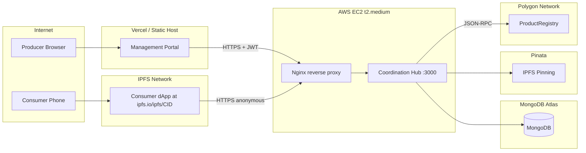

# System Design

Detailed design notes complementing [ARCHITECTURE.md](../ARCHITECTURE.md). Covers communication patterns, auth flow, error handling, and environments.

---

## 1. Communication patterns

### Frontend ↔ Hub (REST over HTTPS)

- All synchronous request/response over JSON.
- JWT Bearer token in `Authorization` header for authenticated routes.
- Refresh token via cookie OR `POST /auth/refresh` body.
- No GraphQL (paper-scale schema is small; OpenAPI gives free reviewer-readable docs).
- No WebSockets in v1 (TanStack Query polling at 30s for verification log dashboard is sufficient).

### Hub ↔ MongoDB

- Mongoose ODM over native MongoDB driver.
- Connection pool: default (max 100 sockets).
- Transaction-free for v1 (single-document writes only); document if multi-document atomicity needed in v2.

### Hub ↔ Blockchain

- ethers.js v6 → JSON-RPC HTTPS to Polygon RPC provider.
- Read calls (`view` functions) cached for 5 s in-memory (LRU) to absorb traffic bursts.
- Write calls: producer wallet (decrypted in memory, signs, zeroed) for `registerProject` + `registerBatch`; system hot wallet for `redeemProduct`.
- Wait for 1 confirmation by default (Polygon block time ~2 s).
- Backoff: exponential (250ms / 500ms / 1s) with 3 retries on RPC failure.

### Hub ↔ IPFS

- Local mode: HTTP API to Kubo at `IPFS_API_URL` (default `http://ipfs:5001` in compose).
- Pinata mode: SDK with JWT.
- Adapter pattern (`uploads/pinata.adapter.ts` vs `uploads/kubo.adapter.ts`) selected at startup by `IPFS_PROVIDER` env var.

### dApp ↔ Polygon (read-only)

- For displaying tx hash → Polygonscan link, no direct RPC call from dApp.
- All blockchain reads go through hub (centralized for caching + simplicity).
- If user wants to verify independently, the dApp surfaces Polygonscan URL; that's their out-of-band check.

### Experiments ↔ Hub / Blockchain

- Direct RPC for performance-critical measurements (registration, verification).
- Bypass hub for adversarial tests that simulate compromised intermediary.
- Records both wall-clock and on-chain measurements (gas used, block time).

---

## 2. Authentication & Authorization flow

### Producer registration

```
Producer (browser, mgmt portal)
  │
  │  POST /auth/register {email, password}
  ▼
Hub (auth.controller)
  ├─► validate (Zod): email RFC 5322, password ≥ 12 chars + complexity
  ├─► check duplicate email → 409 if exists
  ├─► bcrypt.hash(password, 12)
  ├─► generate Polygon wallet (ethers.Wallet.createRandom)
  ├─► AES-256-GCM(privateKey, KEK) → ciphertext
  ├─► insert producer document {email, passwordHash, walletAddress, encryptedPrivateKey}
  ├─► sign access JWT (HS256, 24h) + refresh JWT (HS256, 30d)
  └─► return {accessToken, refreshToken, walletAddress}
```

### Producer login

```
Producer
  │
  │  POST /auth/login {email, password}
  ▼
Hub
  ├─► find producer by email
  ├─► bcrypt.compare → if false, increment failed-attempts; lockout 15 min after 5 in 15 min
  ├─► sign access + refresh JWTs
  └─► return tokens
```

### JWT-protected request

```
Producer (mgmt portal)
  │
  │  PATCH /projects/:phi {description: "..."}
  │  Authorization: Bearer <accessToken>
  ▼
Hub (JwtGuard via @UseGuards(JwtAuthGuard))
  ├─► validate JWT (HS256, exp, iss, aud)
  ├─► attach req.user = {producerId, email, walletAddress}
  ▼
ProjectsController.update(phi, dto, req.user)
  ├─► load project; if project.ownerProducerId !== req.user.producerId → 403
  └─► apply update
```

### Anonymous consumer flow

```
Consumer (dApp)
  │
  │  POST /scan/private {phi, sid}
  │  (no auth header)
  ▼
Hub (no guard)
  ├─► Zod validate (phi: bytes32 hex, sid: hex)
  ├─► h = sha256(sid)
  ├─► verifyProduct(phi, h) → (exists, redeemed, addr_P)
  ├─► if !exists → return COUNTERFEIT
  ├─► if redeemed → query past ProductRedeemed events for prior tx, return ALREADY_VERIFIED
  ├─► else: redeemProduct(phi, sid) via system hot wallet
  ├─► await tx.wait(1)
  └─► return AUTHENTIC{txHash, eventArgs, verifiedAt}
```

### Wallet decryption (producer-only critical path)

```
ProjectsController.createProject
  ├─► load encryptedPrivateKey from MongoDB
  ├─► WalletService.decrypt(ciphertext, KEK) → privateKey buffer
  ├─► wallet = new ethers.Wallet(privateKey, provider)
  ├─► tx = await contract.connect(wallet).registerProject(phi)
  ├─► await tx.wait(1)
  ├─► privateKey.fill(0)              // zero buffer
  ├─► wallet = null                    // release reference
  └─► return tx
```

---

## 3. Error handling strategy

### Error envelope

All hub errors return:

```json
{
  "error": {
    "code": "PROJECT_NOT_FOUND",
    "message": "Project with phi=0x... does not exist",
    "details": {
      "phi": "0x..."
    },
    "requestId": "req_01HABCXYZ..."
  }
}
```

`requestId` is a UUID v7 generated by middleware, also included in `x-request-id` response header and Pino logs.

### Error code → HTTP status mapping

| Domain error                | HTTP | Code                                            |
| --------------------------- | ---- | ----------------------------------------------- |
| Validation failed           | 400  | `VALIDATION_ERROR`                              |
| Missing/invalid JWT         | 401  | `UNAUTHENTICATED`                               |
| Forbidden (ownership)       | 403  | `FORBIDDEN`                                     |
| Resource not found          | 404  | `NOT_FOUND` (e.g., `PROJECT_NOT_FOUND`)         |
| Duplicate (email, phi)      | 409  | `CONFLICT` (e.g., `EMAIL_EXISTS`, `PHI_EXISTS`) |
| Rate limited                | 429  | `RATE_LIMITED`                                  |
| File too large              | 413  | `PAYLOAD_TOO_LARGE`                             |
| Unsupported MIME            | 415  | `UNSUPPORTED_MEDIA_TYPE`                        |
| Hub internal bug            | 500  | `INTERNAL_ERROR`                                |
| RPC unreachable / IPFS down | 503  | `UPSTREAM_UNAVAILABLE`                          |
| Timeout                     | 504  | `UPSTREAM_TIMEOUT`                              |

### NestJS implementation

- `src/common/http-exception.filter.ts` catches all exceptions and maps to envelope.
- Domain exceptions extend a base `DomainException` class with `code`, `httpStatus`, `details`.
- Validation errors thrown by `class-validator` / Zod intercepted and reformatted.
- Unhandled errors → 500 + Pino `error` log + alert in production observability.

### On-chain revert handling

ethers.js v6 throws `CallExceptionError` with a `data` field. Hub decodes the custom error selector against the ABI and maps to a domain exception:

| Contract custom error    | Hub domain exception                                             | HTTP                         |
| ------------------------ | ---------------------------------------------------------------- | ---------------------------- |
| `ProjectAlreadyExists`   | `PhiConflictException`                                           | 409 `PHI_EXISTS`             |
| `ProjectDoesNotExist`    | `ProjectNotFoundException`                                       | 404 `PROJECT_NOT_FOUND`      |
| `UnauthorizedProducer`   | `BlockchainAuthorizationException`                               | 403 `FORBIDDEN`              |
| `BatchTooLarge`          | `BatchTooLargeException`                                         | 400 `BATCH_TOO_LARGE`        |
| `EmptyBatch`             | `EmptyBatchException`                                            | 400 `EMPTY_BATCH`            |
| `DuplicateProductHash`   | `DuplicateProductHashException`                                  | 409 `DUPLICATE_PRODUCT_HASH` |
| `ProductDoesNotExist`    | (in scan path) → returns `COUNTERFEIT` outcome — NOT a hub error | n/a (200 with envelope)      |
| `ProductAlreadyRedeemed` | (in scan path) → returns `ALREADY_VERIFIED` — NOT an error       | n/a (200)                    |

### Rate limiting

- `@nestjs/throttler` package.
- Tiers:
  - `/auth/login`: 5 req / 15 min per IP+email.
  - `/auth/register`: 3 req / hour per IP.
  - `/scan/private`: 60 req / min per IP.
  - All other authenticated routes: 600 req / min per producer.
- 429 response includes `Retry-After` header.

---

## 4. Environments

### Development (`pnpm dev` or `docker compose up`)

| Service           | URL                                                | Notes                                                   |
| ----------------- | -------------------------------------------------- | ------------------------------------------------------- |
| Management portal | `http://localhost:3001`                            | Next.js dev server                                      |
| Consumer dApp     | `http://localhost:3002`                            | Next.js dev server (later: built static + IPFS)         |
| Coordination Hub  | `http://localhost:3000`                            | NestJS with `--watch`                                   |
| MongoDB           | `localhost:27017`                                  | Docker container                                        |
| IPFS Kubo         | `localhost:5001` (API), `localhost:8080` (gateway) | Docker container                                        |
| Hardhat node      | `localhost:8545`                                   | In-process via `npx hardhat node`                       |
| Polygon contract  | (auto-deployed by `contracts-deployer` service)    | Address persisted to `contracts/out/address.local.json` |

### Testnet profile (`docker compose up --profile testnet`)

- Skip `hardhat` + `contracts-deployer` services.
- Hub uses `RPC_URL_AMOY` and `CONTRACT_ADDRESS_AMOY` from env.
- Author publishes the testnet contract address as a constant in `apps/coordination-hub/.env.testnet.example` once deployed.

### Production (`docker compose --profile prod up`)

| Component        | Where                                                          |
| ---------------- | -------------------------------------------------------------- |
| Hub              | EC2 t2.medium (per paper §8) or self-hosted Docker             |
| MongoDB          | MongoDB Atlas (free tier or Flex)                              |
| IPFS             | Pinata (production tier)                                       |
| Polygon contract | Polygon mainnet (gated; manual deploy per `MAINNET_DEPLOY.md`) |
| Mgmt portal      | Vercel or self-hosted Next.js node                             |
| Consumer dApp    | IPFS via Pinata; access via `ipfs.io/ipfs/<CID>`               |

### CI (GitHub Actions)

| Component | Mode                               |
| --------- | ---------------------------------- |
| MongoDB   | service container `mongo:7`        |
| Hardhat   | `npx hardhat node &` background    |
| IPFS      | mocked (`uploads.adapter.mock.ts`) |
| Hub       | spawned as subprocess for E2E      |

---

## 5. Configuration management

- All env vars validated at hub startup via Joi or Zod schema in `src/config/env.schema.ts`.
- Missing required env var → process exits with code 1 + descriptive log.
- `NODE_ENV` toggles debug features (e.g., Swagger UI available in dev only by default; configurable via `EXPOSE_SWAGGER=true`).
- `.env.example` is the source of truth for required variables; CI runs `dotenv-validator` to ensure no env var referenced in code is missing from `.env.example`.

---

## 6. Concurrency and consistency

- **Producer wallet operations**: serial per producer (mutex on `producerId` in-memory) to avoid nonce conflicts when submitting multiple txs.
- **System hot wallet** (`/scan/private`): nonce managed by `ethers.NonceManager`; concurrent redeems serialized.
- **MongoDB writes**: optimistic concurrency via `__v` (Mongoose default) for project edits.
- **Race condition: pre-check passes, redeem fails** — handled in scan service (see [features/coordination-hub.md](../requirements/features/coordination-hub.md) EC-CH-7).

---

## 7. Observability

- **Logging.** Pino structured JSON; log fields: `time`, `level`, `requestId`, `producerId?`, `route`, `latencyMs`, `error`.
- **Tracing.** OpenTelemetry stub (deferred to v2 — placeholder middleware so spans can be added later).
- **Metrics.** Prometheus exposition at `/metrics`:
  - `http_requests_total{method, route, status}`
  - `http_request_duration_seconds{method, route}` (histogram)
  - `blockchain_rpc_errors_total{operation}`
  - `tx_confirmation_seconds{operation}` (histogram)
  - `pin_uploads_total{provider, status}`
- **Health.** `GET /health` returns:
  ```json
  {
    "status": "ok",
    "uptimeSeconds": 12345,
    "checks": {
      "mongo": "ok",
      "rpc": "ok",
      "ipfs": "ok",
      "systemWallet": { "status": "ok", "balanceMatic": "0.42" }
    }
  }
  ```

---

## 8. Deployment topology (production reference)



In v1 the author does not deploy production. Topology documented for future operator (per [features/docs-and-branding.md](../requirements/features/docs-and-branding.md) F14).

---

## 9. Security posture summary

- HTTPS everywhere (TLS terminated at reverse proxy in production).
- Helmet headers (CSP, HSTS, X-Frame-Options).
- CORS whitelist of known origins.
- Strict Content Security Policy (no `unsafe-inline`).
- bcrypt 12 rounds.
- JWT HS256 with 32-byte random secret per env.
- AES-256-GCM for at-rest wallet encryption.
- gitleaks pre-commit + CI.
- Dependency audit gate (`pnpm audit --audit-level high` fails CI).
- No SQL/NoSQL injection (Mongoose with typed queries; never raw $where).
- Path traversal hardening on file uploads (multer with `limits.fileSize`, MIME sniffing).

Detailed in [non-functional.md](../requirements/non-functional.md) §2.
